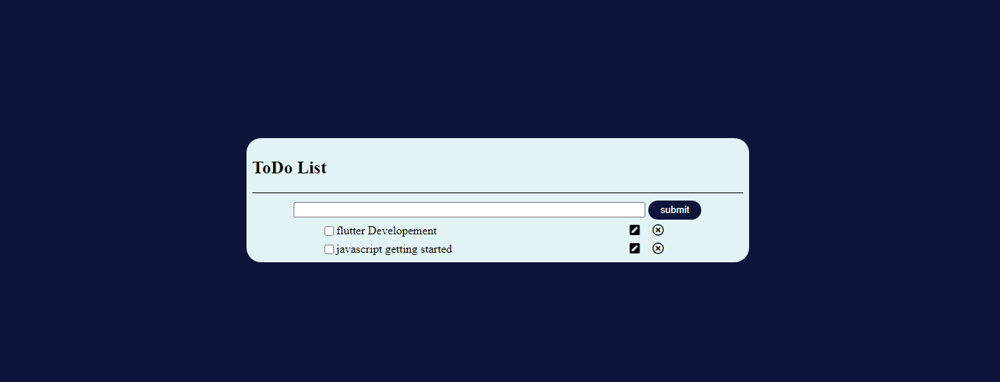
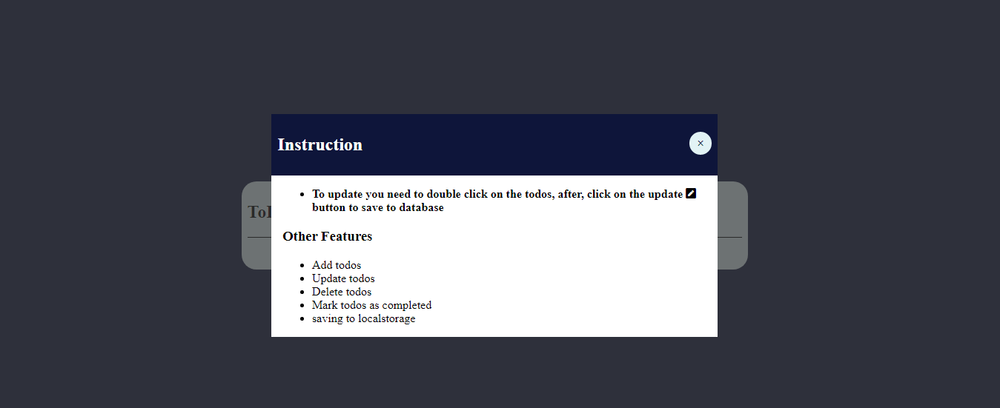

<h1>TODO LIST</h1>

<strong>Goal: </strong>Add, update and delete tasks whenever and wherever you want.

 

<h2>NEAT INTERFACE</h2>

<h4>ToDO List</h4>

 

<h2>FEATURES</h2>
<ul>
    <li>Add tasks</li>
    <li>Achieve tasks</li>
    <li>Delete tasks</li>
    <li>update tasks</li>
    <li>store data in localstorage</li>
</ul>
 

<h2>USAGE</h2>
<ul>
    <li><strong>Git Clone:</strong> To clone the repository locally</li>
</ul>

<h2>LIVE DEMO</h2>
<a href="https://davidolaoluwa360.github.io/todoList/">View todo</a>
